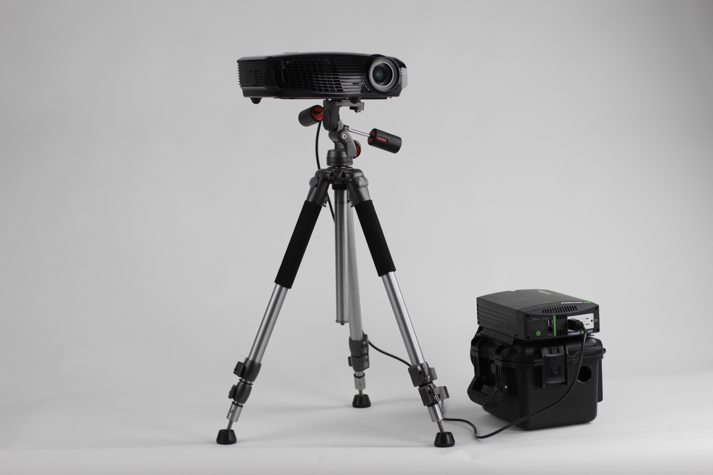
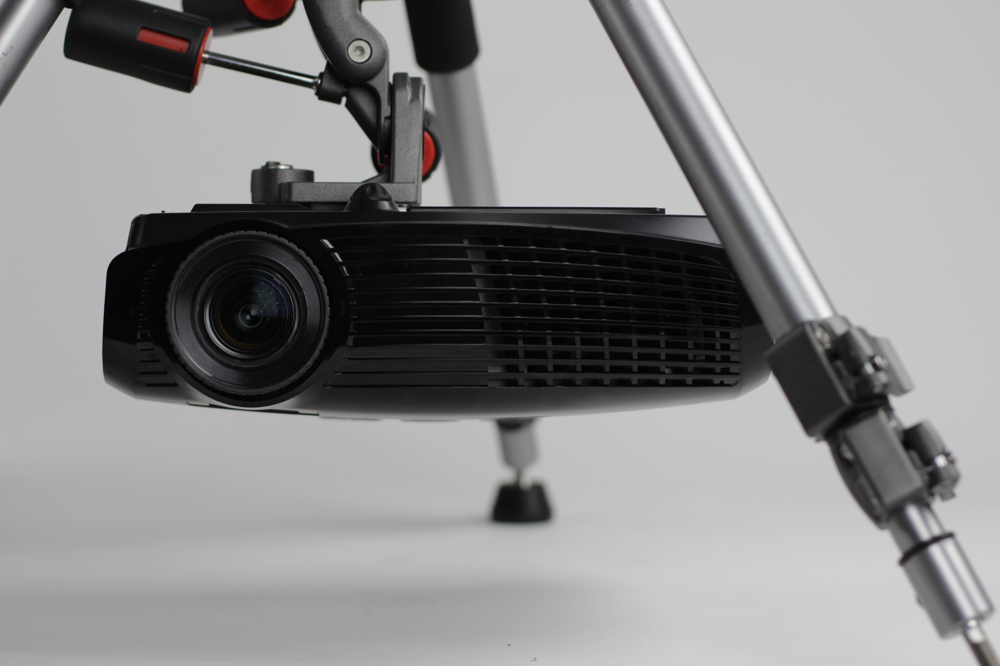
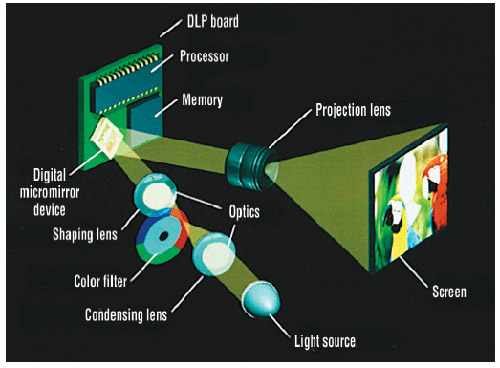
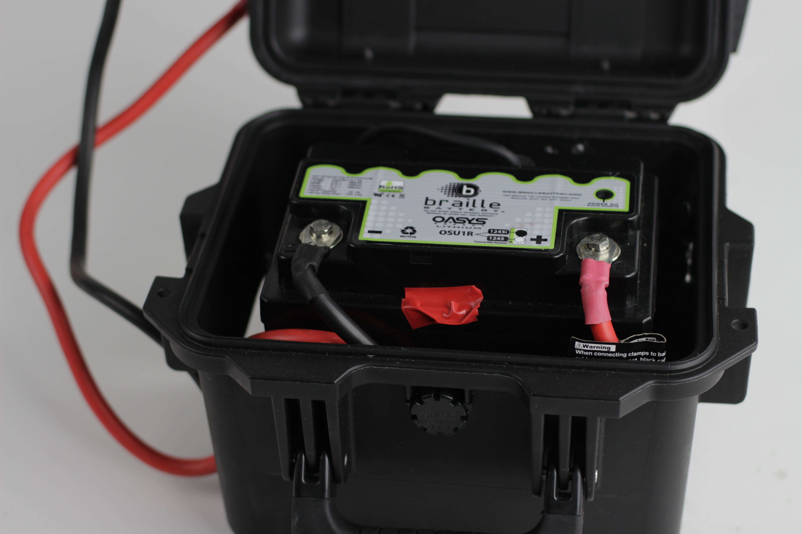
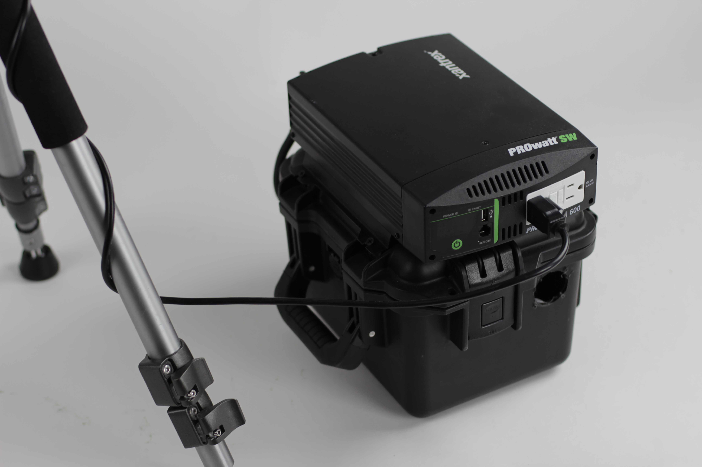
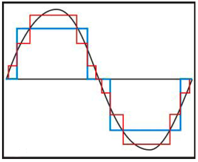
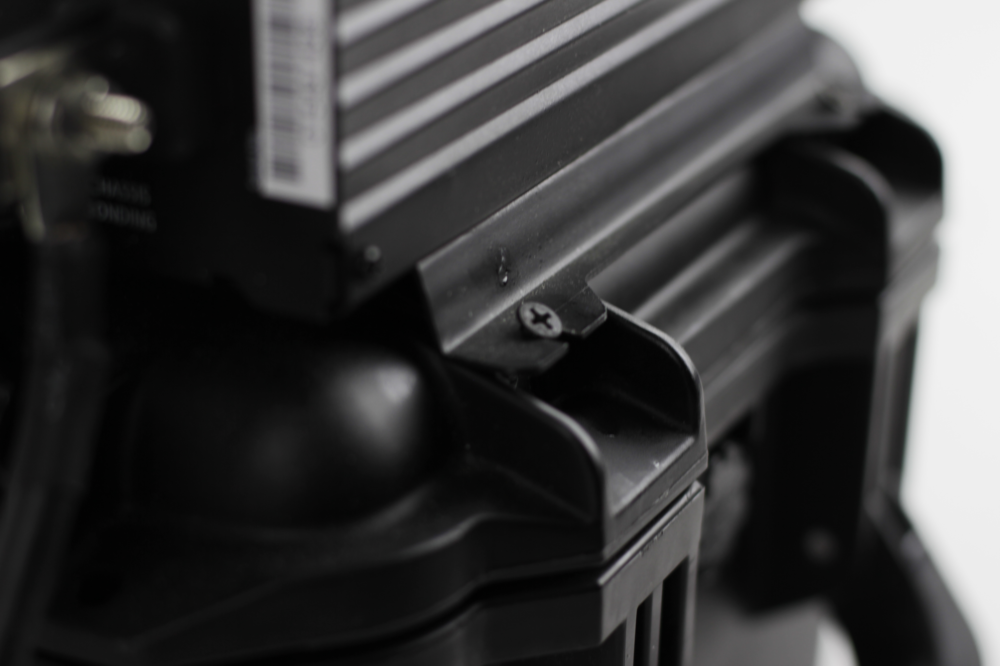
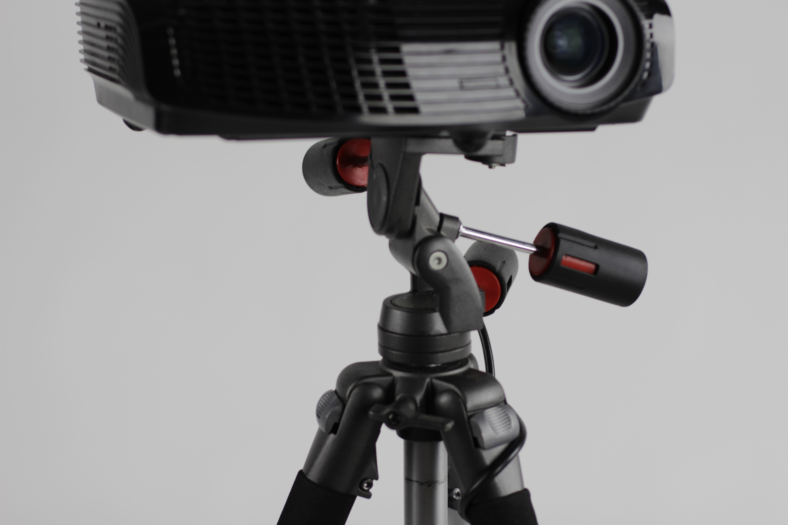
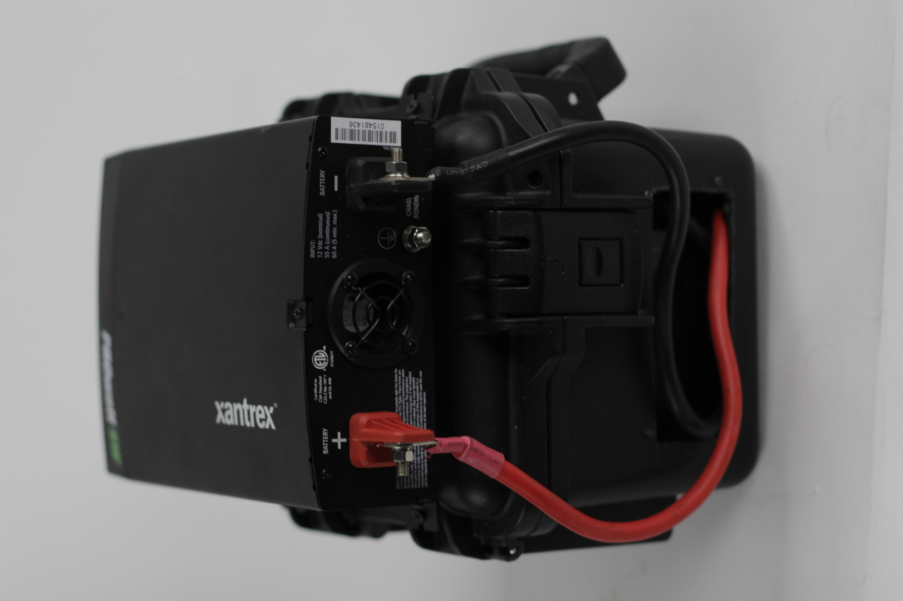

#(P.A.L.S)
##Batou
###Portable battery powered ~3500 Lumen projector

### Ingredients

* Optoma TH1020 Projector <http://www.amazon.com/Optoma-TH1020-Lumens-Multimedia-Projector/dp/B004NEUK5Y/ref=sr_1_1?ie=UTF8&qid=1436040135&sr=8-1&keywords=optoma+th1020>
* Ravelli APGL3 Tripod <http://www.amazon.com/gp/product/B002IFPY2O?psc=1&redirect=true&ref_=oh_aui_search_detailpage>
* Pelican Storm IM2075 Case <http://www.amazon.com/gp/product/B0018NE6GW?psc=1&redirect=true&ref_=oh_aui_search_detailpage>
* Xantrex 806-1206 PROwatt 600 SW Inverter <http://www.amazon.com/gp/product/B002O5P8BA?psc=1&redirect=true&ref_=oh_aui_search_detailpage>
* Braille Battery OSU1R-1245IB <http://www.braillebattery.com/index.php/braille/product_batteries/osu1r_1245ib>
* Braille Battery 12310L 12 Volt 10 Amp/Hour Lithium Rapid Charger <http://www.amazon.com/gp/product/B005P97D38?psc=1&redirect=true&ref_=oh_aui_search_detailpage>
* x4 drywall screws 1 1/2" long

###Projector

* Find a projector that fits your budget and your project. Dont buy the same one used here, its old news. Now you can get brighter, lighter and smaller for less dollar.

* Watch out for supported resolution vs native resolution. Projectors may say they "support" 1920x1080 HD, but their native resolution is what they really are.

* Keep an eye out for the power consumption of the projector, as that will effect how long your battery will last. (the TH1020 is 339 watts)

* If you get a projector that uses a colorwheel you can remove it for extra brightness but you will have a black and white projector. The increase in brightness may be worth it though!

###Battery + Charging

The Braille Battery we used is 45Ah and lasts ~90 minutes with the Optoma TH1020 which claims to draw 339  watts. 

###Inverter

This is a pure sinewave inverter. Which is important.

Most inverters output a stepped square wave(red line), its easier to design a circuit to output this thus they are cheaper and more commonly used, a pure sine wave(black line) is what is provided by your power company. Projectors are not designed for a stepped square wave so you get some buzzing and depending on the quality of the projector it could cause damage.

The inverter is screwed to the top of the pelican case with 4 drywall screws.

###Tripod

The Ravelli APGL3 is a good projector tripod as it has

* Three independently adjustable axis.

If you have to adjust all axis at once it can be tough to get your image exactly right. And with projection mapping you often need to make small adjustments.

* The tripod head can be mounted upsidown.

Since most projectors project the image up somewhat and not straight out, and with non LED projectors your somtimes limited to a tilt of +/- 15 degrees. So being able to invert the projector is super usefull.

###Case

Basicly just cut a hole in the case to feed the positive/negitive cables though. We made it larger than is perhaps nesseccary to air on the side of safety, battery/heat wise.

